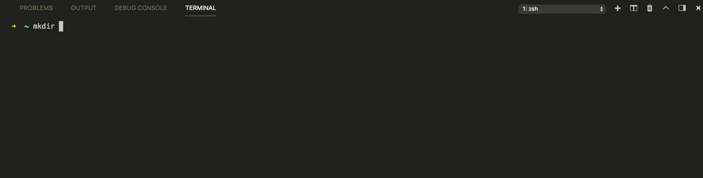
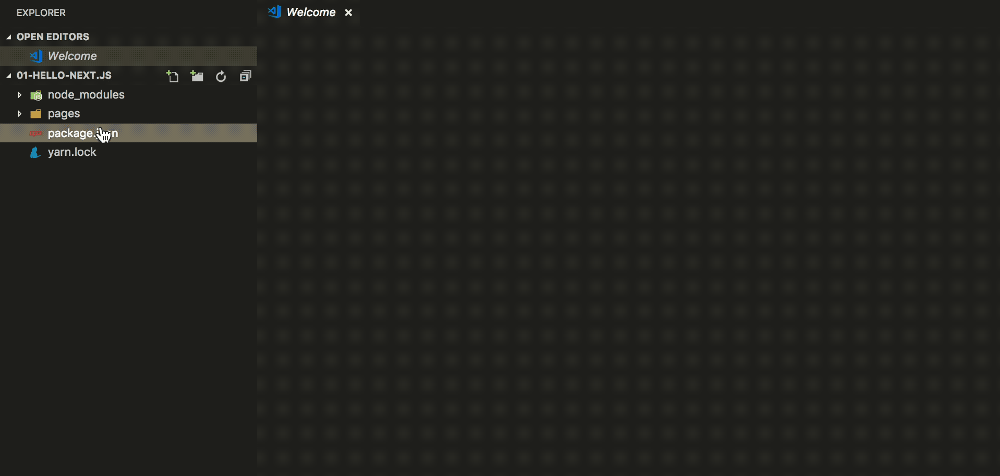
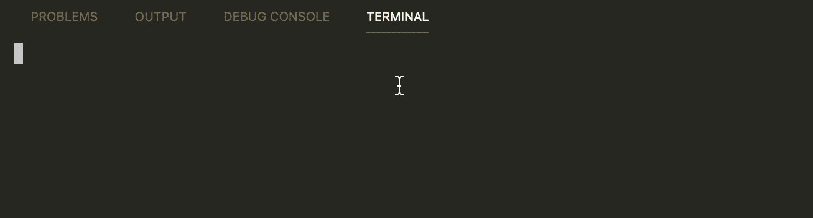
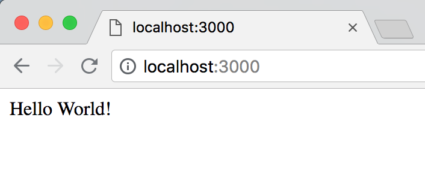

# Getting Start Next.js Project


# First Step

### Init project
```
mkdir 01-hello-next.js
cd 01-hello-next.js
yarn init -y
yarn add react react-dom next --save
mkdir pages
```

### [Terminal Preview]


# Second Step

### Add npm scripts in package.json
```
"scripts": {
  "dev": "next"
}
```

### Create .gitignore file
```
.next
node_modules
```

### Create pages/index.js file
```
class Index extends React.Component {
  render() {
    return (
      <div>Hello World!</div>
    )
  }
}

export default Index
```

### [Code Preview]


# Third Step

### Start dev server
```
yarn dev
```

### Test URL
http://localhost:3000

### [Run Preview]


# Fourth Step

### [Result Preview]
